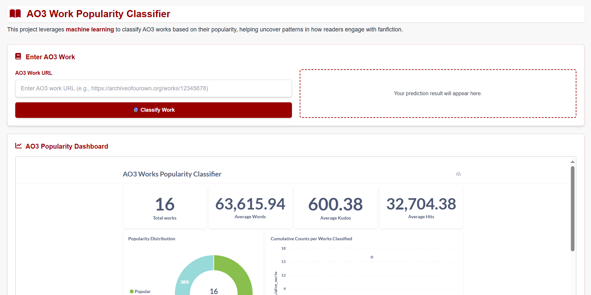
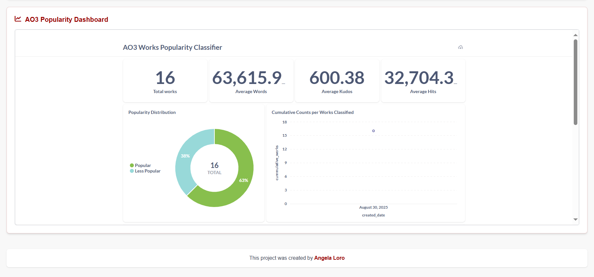
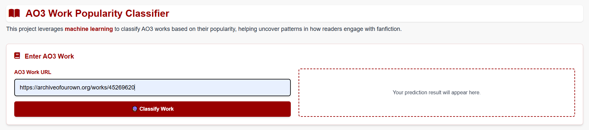
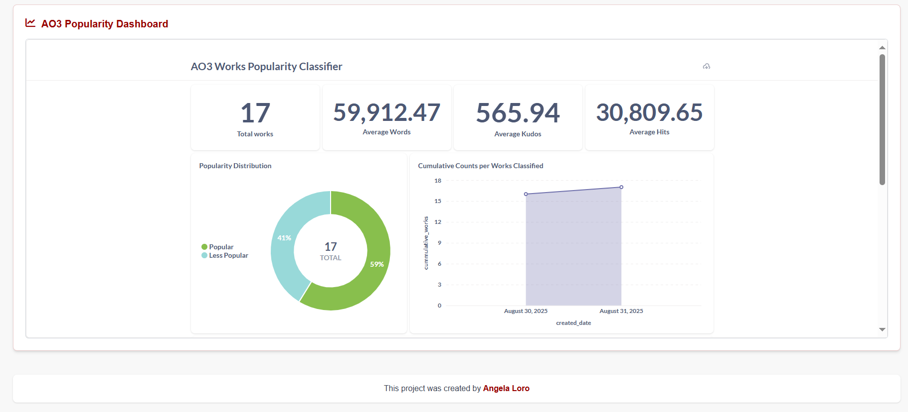

# 📚 AO3 Popularity Classifier
A data science project for scraping AO3 works using Selenium and building a machine learning classifier that predicts the popularity category of a fanfiction work based on metadata such as kudos, bookmarks, comments, hits, and word count.

---

## 🔧 Features
- 🕸️ Selenium Web Scraping to extract metadata from My AO3 History page

- 🗄️ Supabase Database for storing scraped AO3 works and features

- 🤖 Machine Learning Classifier to categorize works into popularity levels (e.g., Popular or Less Popular)

- 📊 Data Visualization of AO3 works distribution using Metabase.

- 🌐 Flask API to serve predictions and fetch stored works

- 🖥️ Simple frontend dashboard to explore scraped data and prediction results

---

## 🧰 Tech Stack

| Component          | Technology                  |
| ------------------ | --------------------------- |
| Scraping           | Python, Selenium            |
| ML Model           | Python, scikit-learn        |
| Database           | Supabase                    |
| Backend API        | Flask                       |
| Frontend           | HTML, JavaScript            |
| Environment Config | python-dotenv               |
| Analytics          | Metabase                    |

---
## 🗃️ Folder Structure

```
Selenium_Scraping-MyAO3_History/
├── data/                  # Raw and cleaned datasets (CSV)
├── frontend/              # Frontend HTML/CSS/JS 
├── model/                 # Trained ML models (e.g. Gradient Boosting.pkl)
├── Selenium_Project.ipynb # Selenium scripts for AO3 scraping
├── cleaning_EDA.ipynb     # Cleaning and Data Exploration to my scrape AO3 History works
├── model.ipynb            # Traning the model  using my scraped data
├── app.py                 # Flask API and storing to Supabase
├── test_api.py            # Utility functions (api fetching, preprocessing, prediction)
├── .env                   # DB credentials and config
└── README.md              # Documentation (this file)
```

---
## 🚀 How It Works  

### 1️⃣ Data Collection (Scraping)  
Using **Selenium**, the system scrapes AO3 works metadata from the user’s history, including:  

- `title`, `link`, `author`  
- `fandom_tags`, `relationship_tags`, `character_tags`, `freeform_tags`  
- `summary`  
- `words`, `chapters`, `languages`  
- `latest_view` (number of times visited in history)  
- `comments`, `kudos`, `hits`, `bookmarks`, `collections`  

> 🔹 **Note:** Only a subset of these features is used for training the ML classifier.  

---

### 2️⃣ Data for Model Training  
For predicting popularity, the following **numerical features** are used:  
  
- **Chapters**  
- **Words**  
- **Kudos**  
- **Bookmarks**  
- **Hits**  
- **Comments**  
- **Latest View (visited count)**  

---

### 3️⃣ Popularity Classification  
- Preprocess dataset (handle missing values, normalize numeric features)  
- Train models such as **Logistic Regression, Random Forest, Gradient Boosting, KNN, SVM**  
- Assign popularity label: **Popular / Less Popular** based on thresholds or classifier output  

---

### 4️⃣ Flask API Endpoints  

- **`/predict` (POST)**  
  - **Input:** JSON with an AO3 work link, for example:  
    ```json
    {
      "url": "https://archiveofourown.org/works/45269620"
    }
    ```
  - **Process:**  
    - Flask retrieves the work’s metadata (`title`, `words`, `kudos`, `bookmarks`, `hits`, `comments`, `chapters`, `latest_view`) using the the [Unofficial AO3 API](https://ao3-api.readthedocs.io/en/latest/install/)  
    - Prepares the features for the trained model  
    - Runs the prediction  
  - **Output:** Predicted **popularity class**, e.g.:  
    ```json
    {
      "title": "Work Title Example",
      "words": 50321,
      "kudos": 1200,
      "bookmarks": 230,
      "hits": 15872,
      "comments": 134,
      "chapters": 10,
      "predicted_popularity": "Popular"
    }
    ```
- ⚠️ **Note:** This works only for **public AO3 stories**. Private or restricted-access works are not supported by the API.  


---

## 📊 Sample Data Structure  

| Column Name  | Description                             |  
|--------------|-----------------------------------------|  
| title        | Work title                              |  
| chapters     | Number of chapters                      |  
| words        | Word count                              |  
| kudos        | Number of kudos                         |  
| bookmarks    | Number of bookmarks                     |  
| hits         | Number of hits (views)                  |  
| comments     | Number of comments                      |  
| latest_view  | User’s visit count in history           |  
| popularity   | Predicted class (Popular / Less Popular)   |  

---


## 🖼️ Screenshots  

### 🔹 Main Dashboard  
The landing page of the frontend, showing AO3 works list with their predicted popularity.  

  
  

### 🔹 Popularity Simulation  
Simulation feature where users can input an AO3 work link and see the predicted popularity class.  

  
  
  

---

## ⚙️ Installation & Setup  

### 1️⃣ Clone the Repository  
```bash
git clone https://github.com/llaight/Selenium_Scraping-MyAO3_History.git
cd Selenium_Scraping-MyAO3_History
```

### 2️⃣ Create a Virtual Environment
```bash
python -m venv venv
source venv/bin/activate   # Mac/Linux
venv\Scripts\activate      # Windows
```

### 3️⃣ Install Dependencies

Make sure you have Python 3.9+ installed. Then install the required packages:

```bash
pip install flask joblib python-dotenv flask-cors supabase ao3-api
```

### 3️⃣ Environment Variables

Create a .env file in the project root to store credentials:

```bash
SUPABASE_URL=your-supabase-url
SUPABASE_KEY=your-supabase-service-role-key
```
- 🔹 Supabase is used for storing AO3 works and predictions.
- 🔹 Ensure your Supabase table schema matches the data structure in this project.
- 🔹 Important: Make sure you configure RLS (Row Level Security) correctly in Supabase. Add the proper policies to allow your API service role key to insert/select from your tables

### 🗄️ Supabase Table Schema

If you want to create the same table structure in Supabase, run this SQL in your Supabase SQL editor:

CREATE TABLE popularity_classifier (
    id BIGSERIAL PRIMARY KEY,
    title TEXT,
    words INT,
    kudos INT,
    bookmarks INT,
    hits INT,
    comments INT,
    chapters INT,
    latest_view INT,
    predicted_popularity TEXT,
    created_at TIMESTAMP DEFAULT NOW()
);

---

## ✅ Deliverables  

- ✅ Selenium scraper for AO3 history  
- ✅ Supabase schema for storing AO3 works  
- ✅ ML classifier for popularity prediction  
- ✅ Flask API for predictions 
- ✅ Frontend dashboard with works + popularity categories  
- ✅ Metabase integration for deeper analytics  

---

## 📜 License  

MIT License — Free to use, modify, and extend for research or personal projects.  

---

## 👩‍💻 Author  

**Angela Loro**  
personal AO3 analytics project  
GitHub: [github.com/llaight](https://github.com/llaight)  